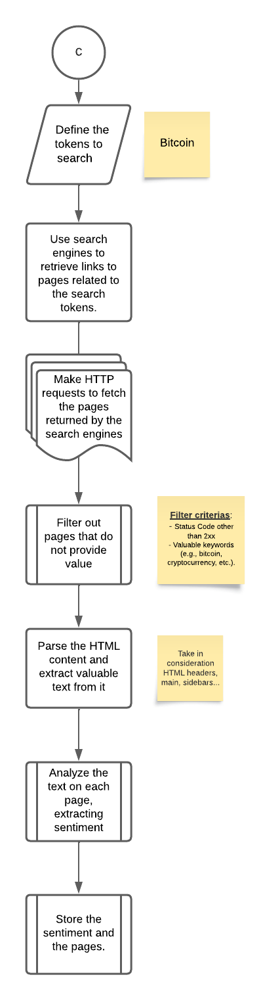

# nlp_utn
## Introduction
This repository contains all the practical assignments related to the subject "Natural Language Processing" from UTN FRBA University.

## Sentiment Analysis Practical Work
The diagram presented below provides a high-level overview of the comprehensive process involved in extracting sentiment from various web pages regarding to a specific cryptocurrency:

    
<b>Define Relevant Tokens</b>

    

    <ul>
    <li>Begin by specifying the tokens related to the cryptocurrency of interest. These tokens will be used to search for relevant web content.</li>
    <li>In this practical assignment I've decided to use "BITCOIN" due its relevant in the market</li>
    </ul>

    
<b>Retrieve Links from Search Engines</b>

    

    <ul>
    <li>Utilize search engines to conduct searches based on the defined tokens.</li>
    <li>With them I'll retrieve a list of links to web pages that are potentially related to the cryptocurrency.</li>
    <!-- COMPLETE WITH WHICH SEARCH ENGINES I WILL USE AND ADD REF -->
    </ul>

    
<b>HTTP Requests for Page Retrieval</b>

    

    <ul>
    <li>Initiate HTTP requests to access and retrieve the web pages identified in the previous step.</li>
    <li>This step involves fetching the content from the web for further analysis.</li>
    <!-- COMPLETE HOW I WILL USE THEM AND ADD REF -->
    </ul>

    
<b>Filter Out Irrelevant Pages</b>

    

    <ul>
    <li>Implement a filtering mechanism to eliminate pages that do not provide valuable information about the cryptocurrency previously defined. </li>
    <li>This ensures that only relevant content is processed.</li>
    <!-- COMPLETE HOW I WILL USE THE FILTERING AND ADD REF -->
    </ul>

    
<b>Parse HTML Content and Extract Text</b>

    

    <ul>
    <li>Parse HTML content of the web pages to extract meaningful textual information.</li>
    <li>This ensures that only relevant content is processed.</li>
    <!-- COMPLETE HOW I WILL PARSE THEM AND ADD REF -->
    </ul>

    
<b>Sentiment Analysis</b>

    

    <ul>
    <li>Perform sentiment analysis on the extracted text from each web page.</li>
    <li>Categorize it as positive, negative, or neutral.</li>
    <!-- COMPLETE HOW I WILL USE THE SENTIMENT ANALYSIS AND ADD REF -->
    </ul>

    
<b>Storage of Sentiment and Pages</b>

    

    <ul>
    <li>Store both the sentiment analysis results and the corresponding web pages in a structured database.</li>
    <li>Categorize it as positive, negative, or neutral.</li>
    <!-- COMPLETE HOW I WILL STORE THEM AND ADD REF -->
    </ul>

